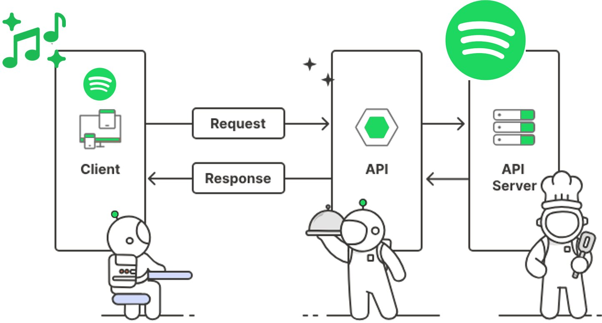

# API Design

<details>
<summary>Index</summary>

## Index

- Introduction
- Request & Response
- HTTP Communication Flow
- Table
- Best Practices
- Request & Response Cycle
</details>

---

<details>
<summary>Introduction</summary>

## API



### API Request Flow

1. Request: The client sends data to the server through an API.
2. Authentication: The server checks who the user is and verifies their identity.
3. Authorization: The server checks if the user has permission to use the API.
4. Validation: If authorized, the server checks if the request data is correct.
5. Processing: The server processes the request and interacts with the database if needed.
6. Response :
   - Success: If everything goes well, the server sends a success response.
   - Error: If something fails, the server sends an error response.

## REST APIs

- REST APIs play an important role in ensuring smooth communication between the client and the server.
- You can think of the client as the frontend and the server as the backend.
- They don't talk directly. Instead, they use an API (Application Programming Interface) as a middleman to exchange information.
- Example: A food delivery app uses a restaurant API to get menu and price details and shows them on your screen.

### REST

- **REST** stands for **Representational State Transfer**.
- Using REST makes applications better by:
  - Scalability: Handling more users and data easily.
  - Reliability: Working smoothly and recovering from problems.
  - Maintainability: Making updates and changes simpler.
  - Flexibility: Supporting different devices (like web or mobile apps).

### REST API Principles

- Unique ID: Each resource should have a unique identifier (URL).
- Standard Methods: Use standard HTTP methods like GET, POST, PUT, and DELETE.
- JSON Format: Send requests and responses in JSON format.

</details>

---

<details>
<summary>Request & Response</summary>

## Request & Response


### Request

#### HTTP Request Structure:

1. Start line: Contains the HTTP method (GET, POST, etc.), URL path, and HTTP version
2. Headers: Key-value pairs providing metadata about the request
3. Body: Optional data sent with the request (common in POST/PUT methods)

#### Common Request Headers:

- Host: Domain name of the server
- Accept: Types of content the client can process
- Authorization: Credentials for authentication
- User-Agent: Client software information
- Content-Type: Format of request body

### Response

#### HTTP Response Structure:

1. Status line: Contains HTTP version, status code (200, 404, etc.), and status message
2. Headers: Metadata about the response
3. Body: The actual content being returned

#### Common Response Headers:

- Content-Type: Format of response body
- Content-Length: Size of response in bytes
- Cache-Control: Caching directives
- Set-Cookie: Session/state management
- Access-Control-Allow-Origin: CORS settings

</details>

---

<details>
<summary>HTTP Communication Flow</summary>

## HTTP Communication Flow


### HTTP Methods (CRUD Operations):

- GET: Retrieve data
- POST: Create new resources
- PUT: Update entire resources
- DELETE: Remove resources
- PATCH: Partial resource updates
- HEAD: Get headers only
- OPTIONS: Get supported methods


### Status Code Categories:

- 1xx: Informational responses
- 2xx: Successful operations
- 3xx: Redirection
- 4xx: Client-side errors
- 5xx: Server-side errors

### Authentication Methods:

- Basic Auth: Base64 encoded username:password
- Bearer Token: JWT or OAuth tokens
- Session-based: Cookie-based authentication
- OAuth 2.0: Token-based authorization framework

</details>

---

<details>
<summary>Table</summary>

## Table

# HTTP Request Properties

## Request Line Components

| Component    | Description                           | Examples                                     |
| ------------ | ------------------------------------- | -------------------------------------------- |
| Method       | Defines the operation to be performed | GET, POST, PUT, DELETE, PATCH, HEAD, OPTIONS |
| URI          | Resource identifier                   | /api/users, /products/123, /auth/login       |
| HTTP Version | Protocol version being used           | HTTP/1.1, HTTP/2, HTTP/3                     |

## Common Request Headers

| Header          | Purpose                    | Example Value                 |
| --------------- | -------------------------- | ----------------------------- |
| Accept          | Acceptable content types   | application/json, text/html   |
| Authorization   | Authentication credentials | Bearer eyJhbGc...             |
| Content-Type    | Format of request body     | application/json              |
| User-Agent      | Client software info       | Mozilla/5.0 (Windows NT 10.0) |
| Host            | Domain name of server      | api.example.com               |
| Cookie          | Client-side data           | sessionId=abc123; user=john   |
| Accept-Encoding | Supported compressions     | gzip, deflate, br             |
| Cache-Control   | Caching directives         | no-cache, max-age=3600        |
| If-Match        | Conditional request        | "33a64df551425fcc55e4"        |
| Origin          | Request origin for CORS    | https://example.com           |

## Request Body Formats

| Format     | Content-Type                      | Usage             |
| ---------- | --------------------------------- | ----------------- |
| JSON       | application/json                  | API data exchange |
| Form Data  | application/x-www-form-urlencoded | Form submissions  |
| Multipart  | multipart/form-data               | File uploads      |
| XML        | application/xml                   | Legacy systems    |
| Plain Text | text/plain                        | Simple data       |

# HTTP Response Properties

## Status Line Components

| Component    | Description           | Examples      |
| ------------ | --------------------- | ------------- |
| HTTP Version | Protocol version      | HTTP/1.1      |
| Status Code  | Response status       | 200, 404, 500 |
| Status Text  | Human-readable status | OK, Not Found |

## Status Code Categories

| Category      | Range   | Meaning                        |
| ------------- | ------- | ------------------------------ |
| Informational | 100-199 | Request received, processing   |
| Success       | 200-299 | Request successfully processed |
| Redirection   | 300-399 | Further action needed          |
| Client Error  | 400-499 | Client-side error              |
| Server Error  | 500-599 | Server-side error              |

## Common Response Headers

| Header                      | Purpose                | Example Value          |
| --------------------------- | ---------------------- | ---------------------- |
| Content-Type                | Response format        | application/json       |
| Content-Length              | Response size in bytes | 1234                   |
| Cache-Control               | Caching instructions   | public, max-age=3600   |
| Set-Cookie                  | Set client-side data   | sessionId=xyz789       |
| Access-Control-Allow-Origin | CORS permissions       | \*                     |
| ETag                        | Resource version       | "33a64df551425fcc55e4" |
| Location                    | Redirect URL           | /api/users/123         |
| X-RateLimit-Limit           | Rate limit max         | 100                    |
| X-RateLimit-Remaining       | Rate limit remaining   | 99                     |
| WWW-Authenticate            | Auth challenge         | Basic realm="login"    |

## Common Response Status Codes

| Code | Message               | Usage                  |
| ---- | --------------------- | ---------------------- |
| 200  | OK                    | Successful GET/POST    |
| 201  | Created               | Resource created       |
| 204  | No Content            | Successful delete      |
| 301  | Moved Permanently     | Permanent redirect     |
| 400  | Bad Request           | Invalid syntax         |
| 401  | Unauthorized          | Authentication needed  |
| 403  | Forbidden             | No permission          |
| 404  | Not Found             | Resource doesn't exist |
| 429  | Too Many Requests     | Rate limit exceeded    |
| 500  | Internal Server Error | Server error           |
| 503  | Service Unavailable   | Server temporary down  |

## Security Headers

| Header                    | Purpose                 | Example Value      |
| ------------------------- | ----------------------- | ------------------ |
| Content-Security-Policy   | Resource loading policy | default-src 'self' |
| X-XSS-Protection          | XSS prevention          | 1; mode=block      |
| X-Frame-Options           | Frame embedding control | DENY               |
| Strict-Transport-Security | HTTPS enforcement       | max-age=31536000   |
| X-Content-Type-Options    | MIME type adherence     | nosniff            |

## Example Response Body Formats

| Format              | Structure                              | Usage           |
| ------------------- | -------------------------------------- | --------------- |
| Success Response    | `{"data": {...}, "status": "success"}` | Data retrieval  |
| Error Response      | `{"error": "message", "code": 400}`    | Error handling  |
| Validation Error    | `{"errors": {"field": ["message"]}}`   | Form validation |
| Collection Response | `{"items": [...], "total": 100}`       | List retrieval  |
| File Response       | Binary data                            | File download   |

</details>

---

<details>
<summary>Best Practices</summary>

## Best Practices

1. Use Nouns for Resources

   - Correct: /users, /orders
   - Incorrect: /getUsers, /createOrder

2. Use HTTP Methods Appropriately
   - GET: Retrieve data
   - POST: Create a new resource
   - PUT: Update a resource
   - DELETE: Delete a resource
   - PATCH: Partially update a resource
3. Use Plural Nouns
   - Correct: /books, /users
   - Incorrect: /book, /user
4. Use Logical Resource Nesting
   - Correct: /users/{userId}/orders
   - Incorrect: /ordersByUser/{userId}
5. Use HTTP Status Codes
   - 200 OK: Successful GET, PUT, PATCH, DELETE
   - 201 Created: Successful POST
   - 204 No Content: Successful DELETE (no response body)
   - 400 Bad Request: Invalid data in request
   - 401 Unauthorized: Authentication failure
   - 403 Forbidden: Authorization failure
   - 404 Not Found: Resource not found
   - 500 Internal Server Error: Server error
6. Use Query Parameters for Filtering, Sorting, and Pagination
   - Filtering: /users?role=admin
   - Sorting: /users?sort=createdAt
   - Pagination: /users?page=2&limit=10
7. ## Consistent and Meaningful Error Responses

```js
{
  "error": "Resource not found",
  "details": "The user with ID 123 does not exist."
   }
```

8. Version Your API
   - Include a version number in your URL:
   - /v1/users
   - /v2/users
   - Example: /api/v1/users

</details>

---

<details>
<summary>Request & Response Cycle</summary>

## Request & Response Cycle

The **request-response cycle** is the process that happens when a client (e.g., browser or mobile app) sends a request to a server (where the website or app data is hosted), and the server responds with the requested data.

```html

```

### Request Flow


#### Example HTTP Request:

```http
GET /home HTTP/1.1
Host: www.example.com
User-Agent: Chrome/91.0
Accept: text/html
```

- **GET**: The HTTP method, requesting the `/home` resource.
- **Host**: The server's address (`www.example.com`).
- **User-Agent**: The client software making the request (e.g., Chrome).
- **Accept**: The type of content the client expects, in this case, `text/html`.

### Response Flow


#### Example HTTP Response:

```http
HTTP/1.1 200 OK
Content-Type: text/html
Content-Length: 1024

<html>
    <body>
        <h1>Welcome to Example!</h1>
    </body>
</html>
```

- **HTTP/1.1 200 OK**: The HTTP version and the status code indicating the request was successful.
- **Content-Type**: The type of data being returned (`text/html`).
- **Content-Length**: The size of the response body in bytes (1024 bytes).
- The **body** contains the actual content, in this case, an HTML page.

### Full Request-Response Example


- The **client** sends a **GET** request for the `/home` resource.
- The **server** processes the request and responds with a **200 OK** status and HTML content.

### Summary of Key Terms

- **HTTP Request**: A message from the client asking the server for data or to perform an action (e.g., GET, POST).
- **HTTP Response**: A message from the server, containing the result of the request or the requested data.
- **Status Codes**: Indicate the result of the request. Common ones include:
  - **200 OK**: Request succeeded.
  - **404 Not Found**: The requested resource doesn't exist.
  - **500 Internal Server Error**: Server encountered an error.
- **Headers**: Metadata sent along with requests and responses (e.g., content type, length, authentication).
- **Body**: The actual content being transferred (e.g., HTML, JSON, images).

</details>

---
